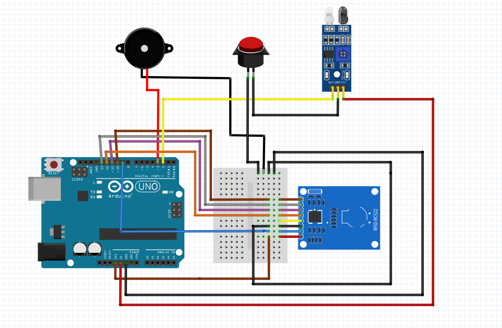

# ABG Prime - Hardware & Firmware

This directory contains the Arduino firmware and hardware configuration for the RFID and IR sensor-based inventory monitoring system.

## 🛠️ Hardware Requirements

*   **Microcontroller**: Adruino Uno R3
*   **RFID Reader**: MFRC522 (13.56 MHz)
*   **Motion Sensor**: IR Obstacle Avoidance Sensor
*   **Alert System**: Passive Buzzer
*   **Input**: Push Button (Manual Override)
*   **Miscellaneous**: Breadboard, Jumper Wires.

## 🔌 Wiring Diagram

The following diagram illustrates the physical connection between the Arduino Uno and the peripheral modules:

## 📌 Pin Mapping

Based on the [RFID_IR_Monitor_v1.ino](./RFID_IR_Monitor_v1/RFID_IR_Monitor_v1.ino) configuration:

| Component | Pin Label | Arduino Uno Pin | Description |
| :--- | :--- | :--- | :--- |
| **MFRC522 (RFID)** | SDA / SS | Pin 10 | SPI Slave Select |
| | SCK | Pin 13 | SPI Serial Clock |
| | MOSI | Pin 11 | SPI Master Out Slave In |
| | MISO | Pin 12 | SPI Master In Slave Out |
| | RST | Pin 9 | Reset Pin |
| | VCC | 3.3V | ⚠️ **DO NOT USE 5V** |
| | GND | GND | Ground connection |
| **IR Sensor** | OUT | Pin 2 | Detection signal to microcontroller |
| | GND | GND | Ground connection |
| | VCC | 5V | 5V power supply |
| **Passive Buzzer** | SIG | Pin 3 | Audible alarm output |
| | GND | GND | Ground connection |
| | VCC | 5V | 5V power supply |
| **Push Button** | SIGNAL | (Directly to IR Sensor GND) | Hardware bypass/trigger |
| | GND | GND | Ground connection |

## 🚀 Features

*   **RFID Read/Write**: Supports MIFARE Classic, Ultralight, and NTAG tags for storing item codes (up to 16 characters).
*   **State-Change Detection**: The IR sensor only sends "MOTION" and "CLEAR" logs on state changes to avoid serial flooding.
*   **Two-Tone Alarm**: A specialized buzzer pattern to alert the cashier of unauthorized movement.
*   **Serial Command Interface**: Supports `READ`, `WRITE:<code>`, `PING`, and `BUZZ_TEST` commands.

## 🛠️ Installation

1.  Connect your Arduino Uno to your PC.
2.  Install the **MFRC522** library via the Arduino Library Manager.
3.  Open `RFID_IR_Monitor_v1/RFID_IR_Monitor_v1.ino` in the Arduino IDE.
4.  Select **Arduino Uno** and your corresponding COM port.
5.  Click **Upload**.

---
*Note: Ensure the serial baud rate is set to **9600** for communication with the Python Bridge.*

---

  <b>Software Engineering 1 Project | 2026</b> 
  Developed for <b>ABG Prime Builders Supplies Inc.</b> 
  <i>A Full-Stack Implementation of Inventory Monitoring and IoT Integration.</i>

