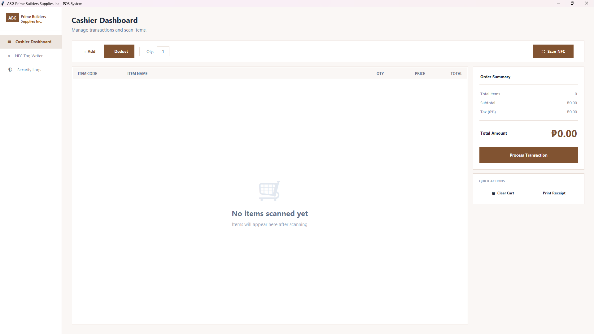
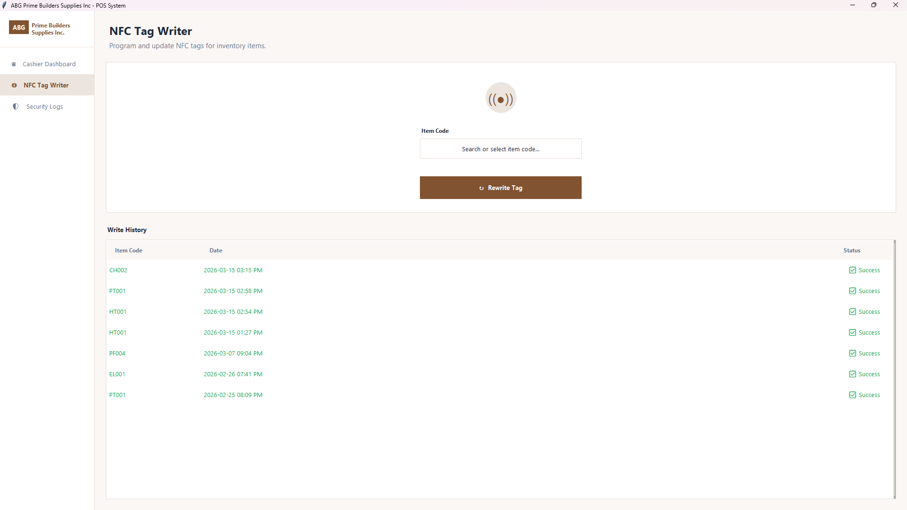
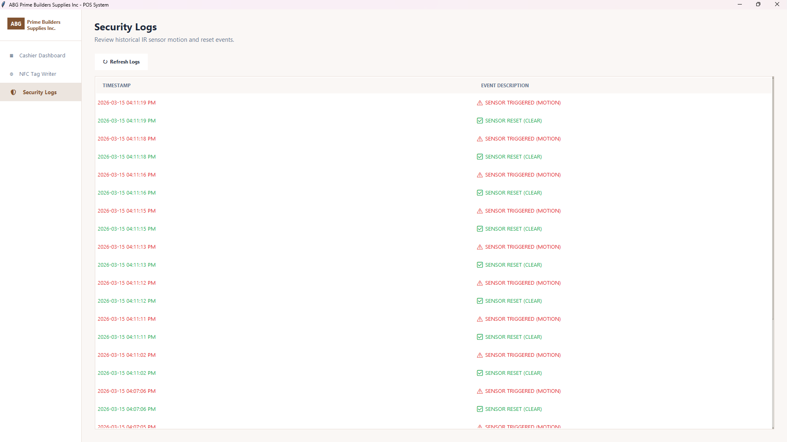

# ABG Prime - Desktop POS Interface

A Python-based desktop application developed with **Tkinter** that serves as the bridge between the physical hardware (Arduino) and the Laravel web backend. It handles real-time inventory adjustments, security monitoring, and hardware programming.

## 🚀 Key Modules & Page Descriptions

### 1. Cashier Dashboard (`app/views/cashier_dashboard.py`)

This is the main operational interface for cashiers.
*   **Item Lookup**: When an RFID tag is scanned or an item code is entered manually, the app sends a `GET /api/pos/item/{code}` request to the Laravel backend to fetch price and product details.
*   **Inventory Adjustment**: Clicking "Process Transaction" triggers a `POST /api/pos/scan` request with `action='decrement'`, which instantly updates the stock in the centralized database.
*   **Security Integration**: Displays the current status of the IR sensor (MOTION/CLEAR). It receives real-time callbacks from the hardware bridge to alert the cashier if unauthorized movement is detected.

### 2. NFC Tag Writer (`app/views/nfc_tag_writer.py`)

Used to prepare physical RFID tags for new inventory.
*   **Searchable Datalist**: Fetches a complete list of valid items from `/api/pos/items` upon launch. It features a "search-as-you-type" interface to prevent manual entry errors.
*   **Hardware Interface**: Communicates with the Arduino via the `WRITE:<code>` serial command to program the item code into the tag's data blocks.
*   **Persistence**: Keeps a local JSON history (`write_history.json`) of recently programmed tags so cashiers can track their work even after an app restart.

### 3. Security Logs (`app/views/security_logs.py`)

A dedicated audit view for warehouse security.
*   **Log Processing**: Instead of querying a cloud database, it reads directly from a local `security_log.txt`. This ensures a zero-latency, offline-capable record of all movement detected by the IR sensor.
*   **Status Indicators**: Uses color-coded text (Red for MOTION, Green for CLEAR) to make the logs easy for security personnel to scan quickly.

---

## 🛠️ API & Security Configuration

The connection between this POS application and the Laravel website is secured via a shared **X-API-Secret** header.

### 1. Generate the Secret
Choose a random, complex string (e.g., `abg_prime_pos_2025_secure_key`).

### 2. Configure the Laravel Backend (`web/.env`)
Add the following line to your web folder's `.env` file:
```env
POS_API_SECRET=your_chosen_secret_key
```

### 3. Configure the POS Application (`pos/.env`)
Create a `.env` file in the `pos/` root directory:
```env
API_BASE_URL=http://your-laravel-domain.com
POS_API_SECRET=your_chosen_secret_key
```

---

## 📦 Installation & Setup

1.  **Navigate to the POS directory**:
    ```bash
    cd pos
    ```

2.  **Create a virtual environment**:
    ```bash
    # Create the environment
    python -m venv venv

    # Activate it (Windows)
    venv\Scripts\activate

    # Activate it (Linux/Mac)
    source venv/bin/activate
    ```

3.  **Install dependencies**:
    ```bash
    pip install -r requirements.txt
    ```
    *Dependencies include `pyserial` for hardware and `python-dotenv` for config management.*

---

## 🏃 Running the Application

1.  **Hardware**: Connect your Arduino Uno (ensure the [Firmware](../firmware/README.md) is uploaded).
2.  **Network**: Ensure the Laravel web server is running and reachable.
3.  **Launch**:
    ```bash
    python main.py
    ```

## 🏗️ Architecture: Asynchronous Threading
The POS system uses a background **Daemon Thread** architecture to ensure the UI stays responsive:
*   **Serial Listener**: One thread constantly listens for "MOTION" or "READ" signals from the Arduino.
*   **API Client**: Each network request to Laravel runs in its own separate thread.
*   **Main Thread (UI)**: Uses Tkinter's `root.after()` to safely update the interface whenever background hardware or network events occur.

---
<p align="center">
  <b>Software Engineering 1 Project | 2026</b><br>
  Developed for <b>ABG Prime Builders Supplies Inc.</b><br>
  <i>A Full-Stack Implementation of Inventory Monitoring and IoT Integration.</i>
</p>
