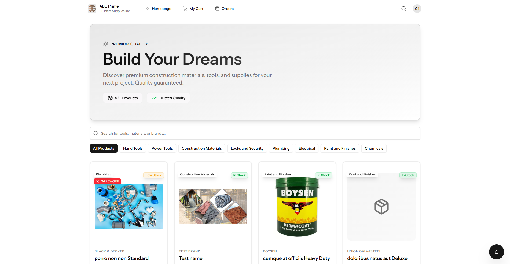
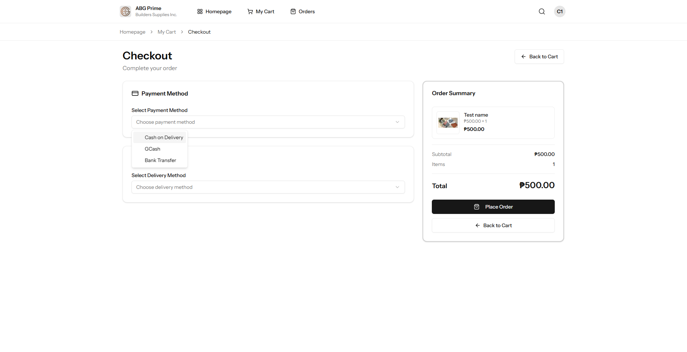
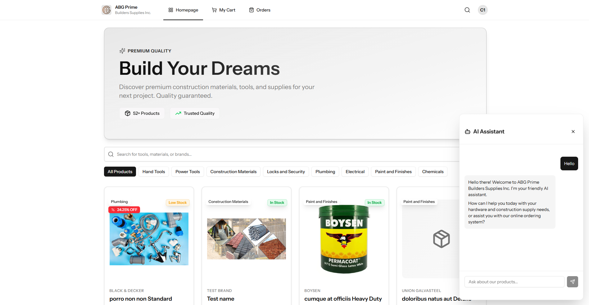
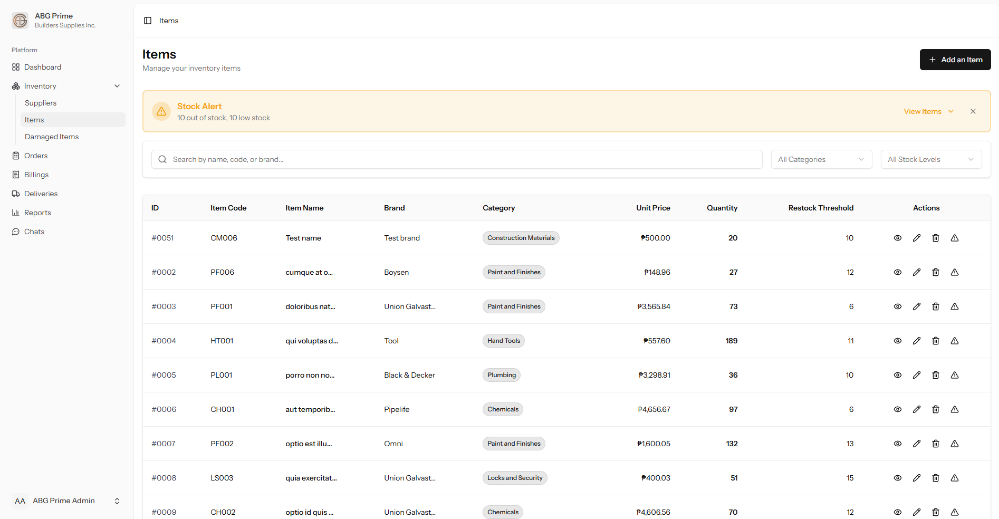
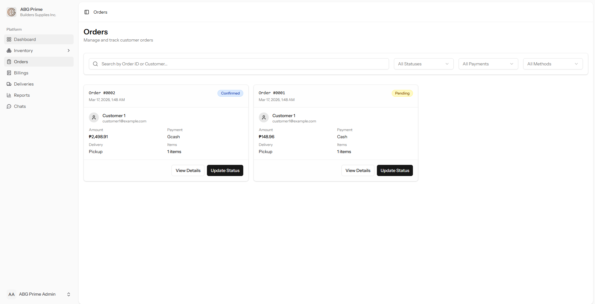
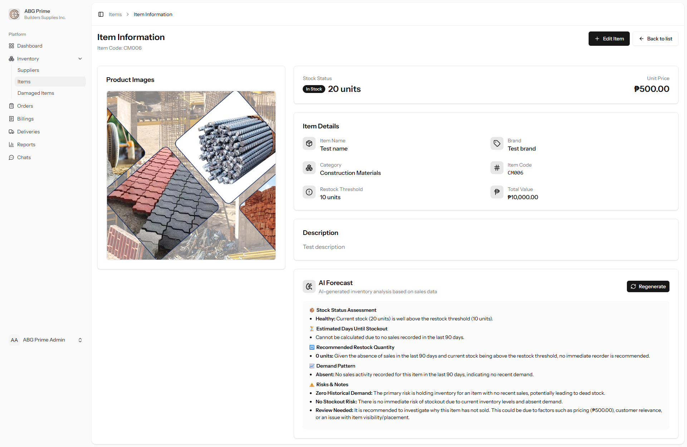

# ABG Prime - Administrative & E-Commerce Web System

The central digital hub for **ABG Prime Builders Supplies Inc.**, designed as a comprehensive **E-Commerce and Inventory Management Platform**. 

---

### 💻 Tech Stack


---

## 🏗️ System Architecture: N-Tier / Multi-Layer
To ensure high performance and modularity, the system is built with an **N-Tier Architecture**:
*   **Presentation Layer**: Reactive Vue.js 3 components via Inertia.js.
*   **Controller Layer**: Request orchestration.
*   **Service Layer**: Complex business logic (AI Chat, Item Forecasting, Payments).
*   **Repository Layer**: Data access isolation using the `app/Repositories` pattern.
*   **Data Layer**: MySQL relational database.

---

## 🛒 Customer Experience (E-Commerce Store)
The web system provides a full-featured e-commerce experience for customers to browse and purchase builder supplies.

### 🛍️ Product Browsing & Cart

*   **Dynamic Catalog**: Customers can browse through various categories of builder supplies.
*   **Smart Shopping Cart**: Add items to the cart, adjust quantities in real-time, and see subtotal calculations instantly.

### 💳 Checkout & Payments

*   **Flexible Payments**: Supports **Cash on Delivery (COD)** and **Online Payments** (GCash, Bank Transfer via Paymongo). Online transactions are automatically marked as **Confirmed** upon successful payment verification.
*   **Order Status Tracking**: Customers can monitor the progress of their orders from "Pending" to "Delivered".

### 🤖 Smart Support

*   **AI Chat Widget**: Powered by **Google Gemini**, providing 24/7 automated assistance for product information and general inquiries.
*   **Customer-Admin Chat**: Real-time live messaging for direct support from staff.

---

## ⚙️ Administrative Oversight
A specialized dashboard for business owners to manage the entire lifecycle of the construction supply business.

### 📦 Inventory & Damage Management

*   **Centralized Tracking**: Real-time stock levels synced with sales and deliveries.
*   **Damage Reporting**: Admins can report damaged items, provide remarks, and set discount percentages. These updates (e.g., discounted "Damaged but Resellable" items) reflect immediately on the customer storefront.

### 🚚 Orders & Fulfillment

*   **Full Lifecycle Tracking**: Manage billings, payments, and delivery scheduling.
*   **Messaging Hub**: Monitor and respond to all customer chat inquiries from a centralized interface.

### 📊 Demand Forecasting

*   **Item Forecast Panel**: Visualizes predicted stock demand based on historical data to help admins make informed restocking decisions.

---

## 🛠️ Configuration & POS Integration
For the entire ecosystem to function, specific API keys must be set in the `.env` file.

### 🔌 POS Connection (IMPORTANT)
If you intend to use the **Desktop POS Hardware Bridge**, you **MUST** configure the shared secret:
1.  Generate a secure key.
2.  Set `POS_API_SECRET=your_key` in the `web/.env`.
3.  The POS application will require this exact key to authorize hardware scans and stock adjustments.

### 🔑 Other API Requirements
*   `GEMINI_API_KEY`: For AI Chat functionality.
*   `PAYMONGO_SECRET_KEY` & `PAYMONGO_PUBLIC_KEY`: For online payment processing.
*   `GOOGLE_CLIENT_ID` & `FB_CLIENT_ID`: For social authentication.

---

## 📦 Detailed Installation & Setup Guide

Following these steps precisely to ensure the administrative system and e-commerce portal are correctly configured.

### 1. Prerequisites
Ensure you have the following installed on your machine:
*   **PHP 8.4+** (with extensions: BCMath, Ctype, Fileinfo, JSON, Mbstring, OpenSSL, PDO, Tokenizer, XML)
*   **Node.js 22.14+** & **NPM**
*   **Composer** (PHP Package Manager)
*   **MySQL 8.0+** or **MariaDB**
*   **A Web Server** (Apache, Nginx, or use `php artisan serve`)

### 2. Initial Setup
```bash
# Enter the web directory
cd web

# Install PHP dependencies
composer install

# Install Frontend dependencies
npm install
```

### 3. Environment Configuration
```bash
# Create your local environment file
cp .env.example .env

# Generate the unique application encryption key
php artisan key:generate
```

### 4. Database Configuration
1.  Open your `.env` file and locate the `DB_` section.
2.  Update the credentials to match your MySQL setup:
    ```env
    DB_CONNECTION=mysql
    DB_HOST=127.0.0.1
    DB_PORT=3306
    DB_DATABASE=abg_prime_db
    DB_USERNAME=your_username
    DB_PASSWORD=your_password
    ```
3.  Run the migrations to create the tables:
    ```bash
    php artisan migrate
    ```
    *(Optional: Add `--seed` if you have seeders prepared for sample data).*

### 5. API Key Configuration (CRITICAL)
Open your `.env` and fill in the following keys to enable system features:
*   **AI Chat**: `GEMINI_API_KEY=your_google_ai_key`
*   **POS Bridge**: `POS_API_SECRET=your_secret_string` (This must match the key in your Python app).
*   **Real-time Messaging**: Verify that `BROADCAST_CONNECTION` is set to `reverb`.
*   **Auth**: Configure `GOOGLE_CLIENT_ID` and `FB_CLIENT_ID` for social logins if needed.

### 6. Real-time Messaging & Broadcasting (Reverb)
To enable the live chat and real-time notifications:
1.  **Install Reverb**:
    ```bash
    php artisan reverb:install
    ```
2.  **Start the Reverb Server**:
    In a dedicated terminal, run:
    ```bash
    php artisan reverb:start
    ```

### 7. Final Steps & Launch
The system uses `composer run dev` to concurrently run the web server, the Vite build process, and the **Queue Listener** (which is essential for sending background notifications).

```bash
# Start all core services (Server, Vite, and Queue)
composer run dev
```

The application will be accessible at: **`http://localhost:8000`**

*Note: For the best experience, ensure both the Laravel server (`composer run dev`) and the Reverb server (`php artisan reverb:start`) are running simultaneously.*

---
<p align="center">
  <b>Software Engineering Project | 2026</b><br>
  Developed for <b>ABG Prime Builders Supplies Inc.</b><br>
  <i>A Full-Stack Implementation of Inventory Monitoring and IoT Integration.</i>
</p>

